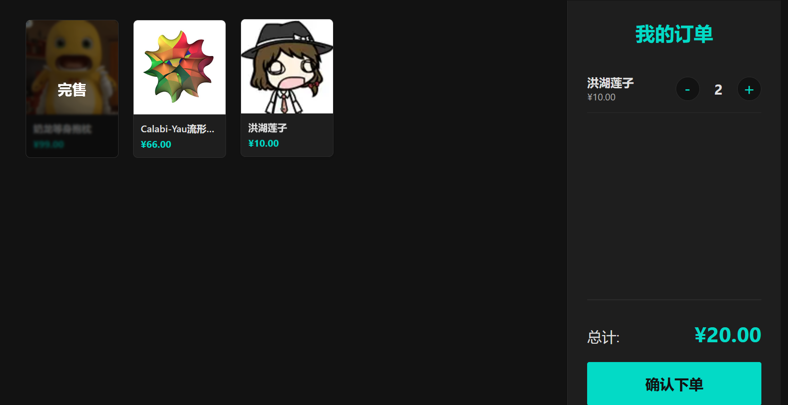
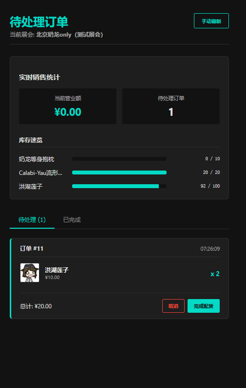

# 东方project展会出摊辅助工具

一个为东方Project同人展摊主打造的、极简高效的销售与库存管理解决方案。

## ✨ 项目简介

专为解决漫展出摊中最繁琐的点单模糊与记账琐碎问题而生。本工具通过清晰的电子菜单、自动化的订单与库存同步，极大提升出摊效率，减轻摊主负担，让您能更专注于与同好的交流。

**核心价值**：

- 对游客：清晰的电子菜单，点击图片即可下单，社恐友好，体验升级。

- 对摊主：订单自动同步，配货如玩模拟经营游戏，自动记账算钱，解放双手。

- 对社团：数据化经营，轻松掌握销售数据和利润，为未来决策提供支持。

**主要特性**：

- 🛒 傻瓜销售界面：屏幕上有所有制品的名字、图片、价格, 游客只需要点击图片就能加入购物车, 自动计算总价并弹出收款码，无需计算和问价，社恐友好。

- 📦 自动库存管理：自动计算售出制品数，实时更新剩余制品数量，完售制品会自动同步到销售界面。

- 📊 实时数据看板：在摊主页面直观计算和展示所有制品的销售额、销量等关键数据，方便统计利润和补货。

- 🔗 极简摊主操作：摊主只需要按照页面提示，像模拟经营游戏一样，按照屏幕显示的订单进行配货和确认即可，无需手动记录任何数据。

- 💾 数据文件导出：支持将销售记录导出为可以直接打印的Excel表格，方便线下备份与对账。

- 🌙 自定义制品与展会：允许社团管理员自定义自己的展会和制品信息，给摊主设置权限与密码。






**线下使用**：

- 社团管理员添加展会和制品信息

- 挂着游客页面的平板电脑放在摊位前，作为电子菜单

- 摊主用自己手机打开摊主页面, 进行订单管理和配货

- 其余计算和统计完全在系统内完成, 用科技解放双手！

## 🏗️ 系统架构与页面

本项目采用**前后端分离**架构：
-   **前端**: Vue 3
-   **后端**: Flask (Python)
-   **数据库**: SQLite

系统包含三个核心页面，对应不同角色：

### 1. 游客页面 - 「电子菜单」
-   **功能**: 浏览商品、加购、下单、支付。
-   **访问**: 无需密码，公开展示。
-   **流程**: 选择展会 -> 浏览商品 -> 点击购买 -> 自动算价 -> 弹出收款码 -> 等待摊主配货。

### 2. 摊主页面 - 「指挥中心」
-   **功能**: 接单、配货、确认完成、查看实时数据。
-   **访问**: 需输入管理员为**本次展会**设置的摊主密码。
-   **流程**: 登录 -> 查看待处理订单 -> 按单配货 -> 点击“完成” -> 系统自动更新库存和统计。

### 3. 管理员页面 - 「后台管理工具」
-   **功能**: 管理全局数据、初始化展会。
-   **访问**: 需输入最高权限密码（通过环境变量 `ADMIN_PASSWORD` 设置）。
-   **操作**:
    -   **管理展会**: 增删改查展会信息，设置摊主密码。
    -   **管理制品**: 维护社团的全局商品库（上传图片、设置名称、分类等）。
    -   **上架商品**: 为特定展会选择商品并设置初始库存和售价。
    -   **订单操作**: 查看所有订单，必要时进行干预。

## 🚀 快速部署

### 环境要求
-   **服务器**: 一台拥有公网IP的云服务器（如阿里云、腾讯云）。
-   **运行环境**: `Python 3.8+`, `Node.js 14+`, `nginx`。
-   **域名** : 已备案的域名，用于访问系统。

### 部署步骤 (概要)
由于您有自己的服务器，以下是部署流程概要，具体命令可根据您的环境调整。

1.  **获取代码**
    ```bash
    git clone https://github.com/Renko6626/abl_sale_tool.git
    cd abl_sale_tool
    ```

2.  **后端部署 (Flask)**
    ```bash
    # 创建虚拟环境并安装依赖
    python3 -m venv venv
    source venv/bin/activate
    pip install -r requirements.txt

    # 配置环境变量（设置密钥、数据库路径、管理员密码等）
    cp .env.example .env
    vim .env

    # 使用 Gunicorn 启动应用
    gunicorn -w 4 -b 127.0.0.1:5000 app:app
    ```

3.  **前端部署 (Vue 3)**
    ```bash
    # 安装依赖并构建生产环境静态文件
    npm install
    npm run build
    # 将构建好的 dist 目录内容部署到 nginx 服务的根目录下
    ```

4.  **配置 Nginx**
    编辑 nginx 配置文件，将 API 请求代理到后端的 Gunicorn 服务。
    ```nginx
    server {
        listen 80;
        server_name your-domain.com; # 你的域名或IP

        # 静态文件（前端）
        location / {
            root /path/to/your/vue/dist;
            index index.html;
            try_files $uri $uri/ /index.html;
        }

        # 动态 API（后端）
        location /api/ {
            proxy_pass http://127.0.0.1:5000/;
            proxy_set_header Host $host;
            proxy_set_header X-Real-IP $remote_addr;
        }
    }
    ```
    重启 nginx 服务即可。

## 🤝 如何贡献

我们欢迎一切形式的贡献！无论是提出建议、反馈Bug还是直接提交代码。

1.  Fork 本仓库
2.  创建特性分支 (`git checkout -b feat/Feature`)
3.  提交你的更改 (`git commit -m 'Add some Feature'`)
4.  推送到分支 (`git push origin feat/Feature`)
5.  开启一个 Pull Request
6.  等待审核与合并
7.  感谢您的贡献！

## 📜 开源协议

本项目采用 [MIT](https://choosealicense.com/licenses/mit/) 协议。请查看 `LICENSE` 文件了解更多信息。

## 🔮 未来规划

-   [ ] **移动端App开发**：开发原生App版本，提供更好的离线体验和推送通知。

---

**祝您出摊顺利，场场完售！**


